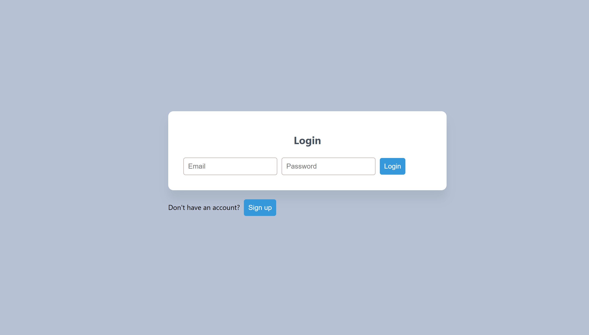

# ✅ ToDoApp

A full-stack ToDo application built with **Spring Boot**, **React**, and **H2 Database**.  
Supports user registration, login, task management, filtering, and due dates — all in a responsive, styled UI.

---

## 🚀 Features

- 🔐 **User Authentication** – Register and log in with email and password
- ✅ **CRUD Tasks** – Create, update, delete, and mark tasks as completed
- 📆 **Due Dates** – Assign and display due dates for each task
- 🔎 **Filter Tasks** – View all, completed, or pending tasks
- 💾 **H2 Database** – Fast in-memory data storage with optional console
- 💅 **Responsive UI** – Clean, centered design with modern styling

---

## 🛠 Tech Stack

| Frontend | Backend     | Database |
|----------|-------------|----------|
| React    | Spring Boot | H2       |
| Vite     | REST API    | JPA      |
| CSS      | Java        | Hibernate|

---

## 🧪 Screenshots


- 
- 

---

## 📦 Project Structure

```
todo-app/
├── backend/
│   └── src/main/java/com/example/todo/
│       ├── model/          → User, Todo entities
│       ├── repository/     → JPA Repositories
│       ├── controller/     → REST Controllers (Auth + Todo)
│       └── TodoApp.java    → Main Spring Boot app
├── frontend/
│   ├── src/
│   │   ├── App.jsx
│   │   ├── components/
│   │   │   ├── Login.jsx
│   │   │   ├── Signup.jsx
│   │   │   └── TodoList.jsx
│   │   └── style.css
│   └── index.html
```

---

## 📖 How to Run

### ▶️ Backend (Spring Boot)

```bash
cd backend
mvn clean install
mvn spring-boot:run
```

🧪 Access H2 console: [http://localhost:8080/h2-console](http://localhost:8080/h2-console)  
(JDBC URL: `jdbc:h2:mem:todo-db`)

---

### ▶️ Frontend (React + Vite)

```bash
cd frontend
npm install
npm run dev
```

📍 Visit: [http://localhost:5173](http://localhost:5173)

---

## 🔐 Sample Test Users

| Email              | Password |
|-------------------|----------|
| `test@user.com`   | `1234`   |
| `admin@todo.com`  | `admin`  |

---

## 🧹 TODOs / Improvements

- 🔐 Replace plain text passwords with hashed (BCrypt)
- ☁️ Deploy on Vercel + Render (or Spring Boot on Fly.io)
- 📱 Add mobile-first responsive enhancements
- 📨 Add email notifications before due dates (optional)

---

## 📝 License

MIT License © 2025 Brahim Kacem
